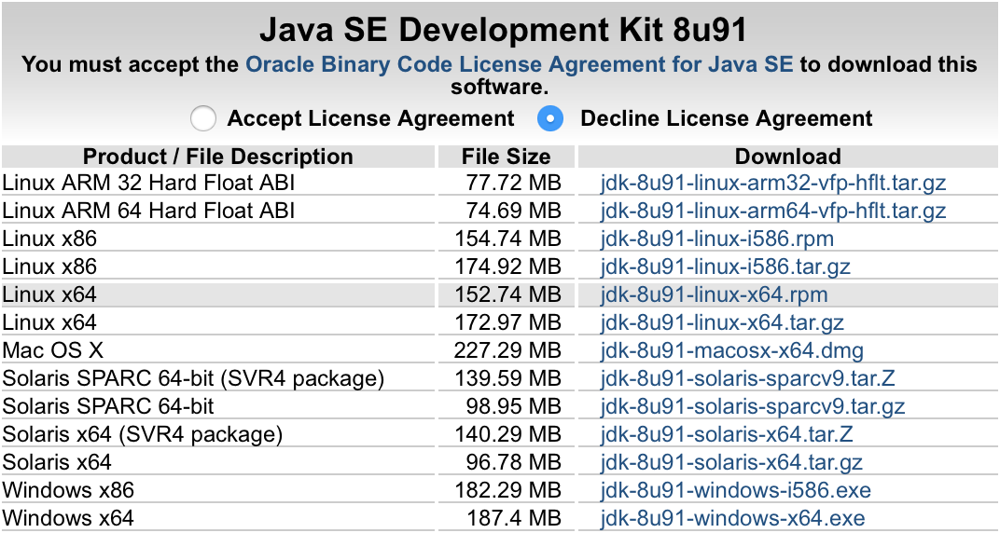
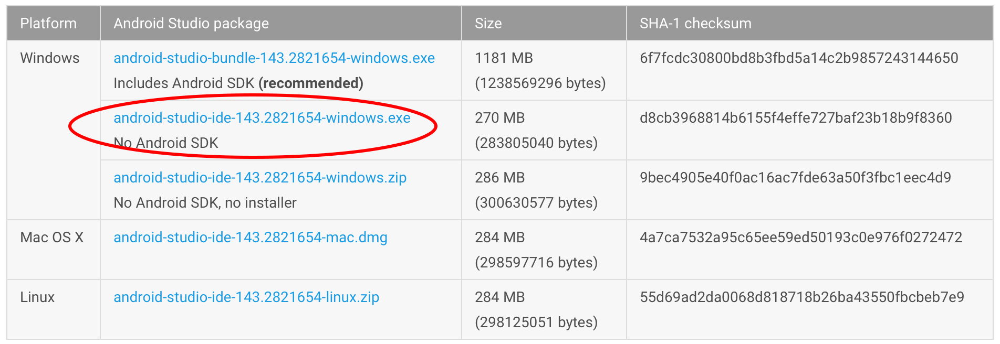
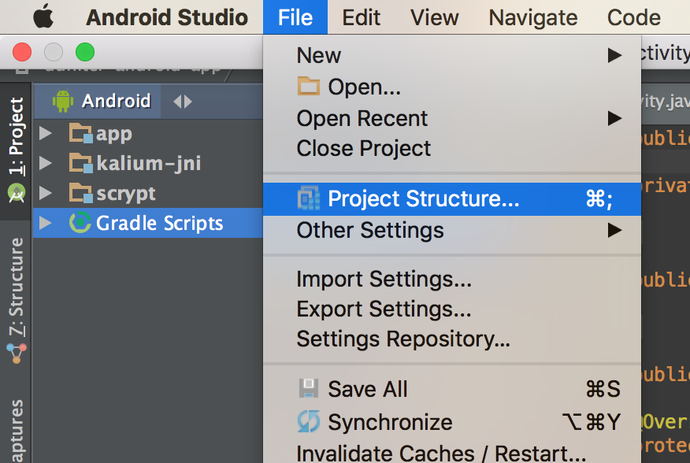
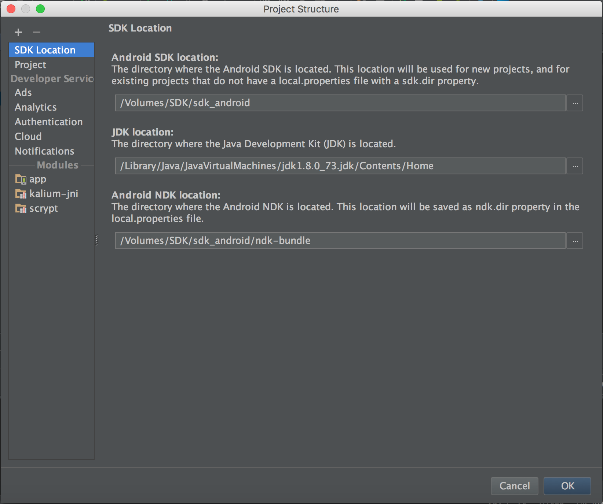

# Build Cesium for Android

Cesium can be build as an Android App.

Cesium use [Ionic Framework v1.7.16](http://ionicframework.com/docs/v1/) with some Apache Cordova plugins.

## Prerequisites

### Install the development environment

Follow all the steps defined in the [Development guide](./development_guide.md).

After that you should be able to start the application using `npm start`, and to test it.

### Install JDK (Java Development Kit)

You can choose to install
 
- on Linux, install OpenJDK 11:
 
  * ``sudo apt-get install openjdk-11-jdk``
    
- or Oracle JDK 8 (all platforms supported):
  
   * Download it from [Oracle web site](http://www.oracle.com/technetwork/java/javase/downloads/jdk8-downloads-2133151.html)
   
   

   And choose the right version, depending on your platform.

### Install Android Studio


Download Android Studio from the [AndroidStudio-Downloads page](https://developer.android.com/studio/index.html#downloads)

- On MS Windows:
  
  * Download file **without** the Android SDK:
  
  
  * Then follow installation steps.

- On Linux : 
 
  * download the full archive, then uncompress it (e.g in `/opt/android-sdk`).

  * open a terminal, run the command:
  ```bash
  ./bin/studio.sh
  ```

At the end of the installation or the first launch, Android Studio will indicate that you do not have an SDK and will propose to install it.

Install the version that it proposes to you.

### Install Android NDK

> The NDK is used for code execution in C ++, need to build the NaCL cryptography library.

- Download NDK from [this page](https://developer.android.com/ndk/downloads/index.html)

  * **Warning**: Please use version `r10d` (not tested on newer versions).

- Uncompress the archive (e.g on Linux, in a new directory `/opt/android-ndk`).

- Launch Android-studio, then open the menu `File > Project Structure...`

  

- A window like this should open: 

  

- Fill in the installation path of the NDK.

### Install Gradle

- Download [Gradle 4.1](wget https://services.gradle.org/distributions/gradle-4.1-bin.zip)

- Uncompress the archive (e.g in `/opt/gradle`).

## Android configuration

Android need some configuration, to be able to build Cesium.

- First, create a properties file `local.properties` in the directory `platforms/android`:
 
```properties
# Path to your Android SDK installation
sdk.dir=/opt/android-sdk

# Path to your Android NDK installation
ndk.dir=/opt/android-ndk
```

- In order to sign your Android builds: 
 
  * Generate a new keystore file :
```
keytool -genkey -v -keystore Cesium.keystore -alias Cesium -keyalg RSA -keysize 2048 -validity 10000`
```

  * Create a file `release-signing.properties` in the directory `platforms/android`:
```properties
storeFile=/path/to/Cesium.keystore
keyAlias=Cesium
storePassword=YourStorePassword
keyPassword=YourKeyPassword
```

- Open Android Studio, then open the menu `File > Settings...`. Set `Gradle Home` to your fresh Gradle installation directory (e.g. `/opt/gradle`).

## Generate APK file

 - To build a signed APK file:
```
ionic build android --release
```

 - To build an unsigned (debug) APK:
```
ionic build android
```

Generated APK files should be in the directory `platforms/android/build/outputs/apk`.

### Troubleshooting

#### "Cannot run program (...)/aapt"

If you get this error:

```
Cannot run program "/opt/android-sdk/build-tools/21.1.2/aapt": error=2, No such file or folder
```

Then install two additional compatibility libraries (workaround found in [this post](http://stackoverflow.com/questions/22701405/aapt-ioexception-error-2-no-such-file-or-directory-why-cant-i-build-my-grad)):                            
```bash
sudo apt-get install lib32stdc++6 lib32z1
```
