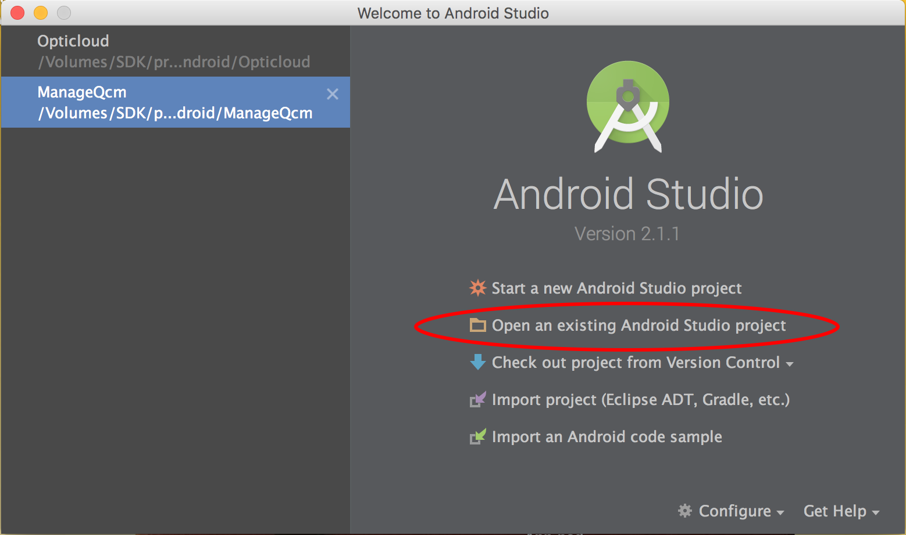
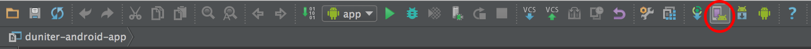

## Introduction

This article is a tutorial to develop on Cesium, to compile and test the application on Android.

## Prerequisites

Before doing this tutorial, you must: 

 - Have followed the tutorials on Cesium [up to level VIII] (./development_tutorial-02.md)

## Level IX

### Objective

The objective here is to install the basic tools to compile and verify its proper functioning under Android. You will achieve: </p>

- installation of `JDK`
- installation of `Android Studio` software
- installation of  `KVM` emulator
- installation of `NDK Android` (optional - will be needed later)

### Installing software

#### Installing JDK

The JDK or _Java Development Kit_

You can download it from [Oracle](http://www.oracle.com/technetwork/java/javase/downloads/jdk8-downloads-2133151.html).


Depending on your operating system, download corresponding.

Then install the file as normal, following the guided steps.

#### Install Android Studio

You can find all files at [AndroidStudio-Downloads](https://developer.android.com/studio/index.html#downloads)

For Windows download file without Android SDK:


##### For Linux

All you need to do is unzip the ZIP file, open a terminal in that folder, and type the command:
```bash
./bin/studio.sh
```

##### For Windows and Mac OS

Install the executable you downloaded earlier.

##### All machines combined

At the end of the installation or at the first launch, Android Studio will tell you that you do not have an SDK and will offer to install it:

- If you have already installed it, you can indicate where it is.
- Otherwise install the version it offers.


#### Install NDK (optional)

> The NDK is used for executing code under C++, in particular the NaCL cryptography library.
> This step is currently optional (for experts only).

You can download it at: [this site](https://developer.android.com/ndk/downloads/index.html)

Warning: do not install version 12 of the NDK. It's not stable yet.

Once again downloaded the correct version, unzip the file next to your SDK.

Under Android Studio go to the menu `File > Project Structure...`


A window like this should open:


Enter the NDK installation path.

#### Install KVM emulator (optional)

For Linux / Debian only:

```bash
sudo apt-get install kvm qemu-kvm libvirt-bin bridge-utils virt-manager
sudo groupadd libvirtd
sudo adduser `id -un` libvirtd
```

##### In case of problem...

If you get this error :
```
Cannot run program "/home/eis/android-sdks/build-tools/21.1.2/aapt": error=2, Aucun fichier ou dossier de ce type
```

Install two additional compatibility libraries (solution from [this post](http://stackoverflow.com/questions/22701405/aapt-ioexception-error-2-no-such-file-or-directory-why-cant-i-build-my-grad)) :                            
```bash
sudo apt-get install lib32stdc++6 lib32z1
```


## Level X: Launching the application in Android Studio

### Project Setup

Go to the folder in which you installed cesium using the `cd` command followed by the path to the appropriate directory.

Check that you are using the version of NodeJs that Cesium needs using the command

```
node --version
```

If you are not on a v6, use the command

```
nvm use 12
```

You can now launch the installation of the Cesium project for Android:


```
ionic cordova prepare
```

Normally, this command should initialize (among other things) a `platforms/android` directory.

> This command may take a moment to complete.

Now run the build for Android:

```
ionic build android
```

Now launch Android Studio. You should arrive at this window:




Select "Open an existing Android Studio project" and point the folder to `cesium/platforms/android`.

### Launch the application

To be able to launch an emulator, we will have to create one.

To do this, go to `Tools` > `AVD Manager`, or click on the following icon:



A window will open and offer you to create a "Virtual Device" follow the software.

If you have an Android phone you can put it in developer mode and plug it in if you want to see the app on your phone.

Then, once the emulator is created, you can click the "Play" button () to launch the application.
You can also use the icon () to launch the application in debug mode.

Android Studio will ask you which device you want to launch the app on, select emulator or phone and leave it alone.


## Level XI: Application launched by `ionic`

You can now use the `ionic` tool directly:

 - Either to launch your application on a connected phone:
  ```bash
  ionic run android
  ```

 - Either to launch it on an emulator:
  ```bash
  ionic emulate android
  ```

## The following ?!

You can now continue with the following levels. We will see there how to add a plugin to Cesium.

[See more here >>](../fr/development_tutorial-04-add_plugin.md)