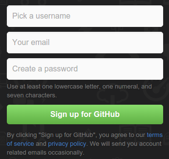
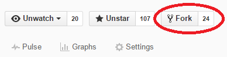
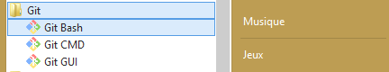
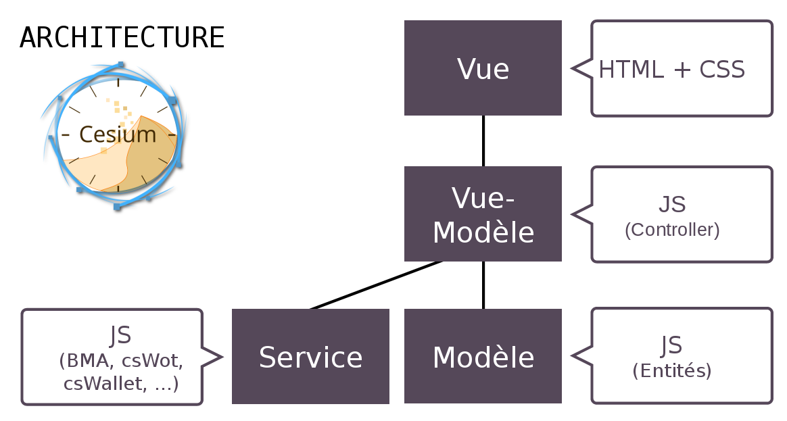
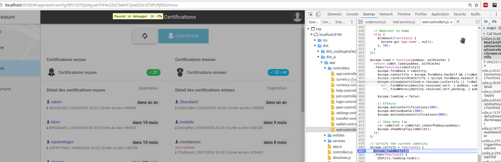

## Introduction

Cet article est un tutoriel d'initiation au code source du logiciel Cesium. Celui-ci vous permettra, à travers une succession d'étapes, d'accéder à la maîtrise des outils et méthodes utilisés quotidiennement par les développeurs de Cesium pour créer et modifier le logiciel.

A la fin de ce tutoriel, vous serez donc *capable de modifier le logiciel*. Et si le cœur vous en dit, vous pourrez même réaliser une modification et partager celle-ci avec le dépôt de code principal, afin que celle-ci soit officiellement intégrée et disponible aux utilisateurs !

A vos claviers !

## Niveau I : récupérer le code source

Ce premier niveau consiste à créer *votre propre version* des sources du logiciel et de récupérer cette copie sur votre ordinateur. Vous y produirez : 

* votre propre compte *GitHub*
* votre propre version du logiciel, votre *fork*
* une copie locale des fichiers de code source provenant de votre *fork*

### Créez un compte GitHub

> Si vous disposez déjà d'un compte GitHub, vous pouvez passer cette étape.

Rendez-vous sur https://github.com (site en anglais). Renseigner les 3 champs proposés :

* Nom d'utilisateur
* E-mail
* Mot de passe



Vous recevrez probablement un e-mail de confirmation qu'il vous faudra valider. Une fois cette étape passée, vous devriez disposer d'un compte GitHub .

### Forkez le dépôt principal

Rendez-vous à l'adresse https://github.com/duniter/cesium. Cliquez sur le bouton « Fork » en dans le coin supérieur droit de la page :



### Installer Git

L'installation de Git dépend de votre système d'exploitation. Suivez simplement les indications présentes sur : https://git-scm.com/

### Cloner votre fork

A ce stade, vous êtes en mesure de récupérer votre version du code source (votre *fork*), afin de pouvoir travailler dessus.

#### Ouvrez Git en ligne de commande

Pour récupérer le code source, lancez Git en mode console.

* Sous Linux et MacOS, ouvrez tout simplement le Terminal
* Sous Windows lancez le programme *Git Bash* :



#### Clonez votre fork, en ligne de commande

Retournez sur la page web GitHub, puis trouvez le bouton « Clone or download » : 
Cliquez dessus, vous pourrez alors copier l'URL de clonage en cliquant sur l'icône de valise.

Vous n'avez plus qu'à retourner dans votre console Git et saisir : 

    git clone <coller l'URL copiée>

ce qui donne dans mon cas : 

```
git clone https://github.com/blavenie/cesium.git
Cloning into 'cesium'...
 (...)
Checking connectivity... done.
```

Si vous êtes arrivés à un comportement similaire, **bravo**, vous posséder désormais le code source Cesium !
 
## Niveau II : Compilation et lancement dans un navigateur

Ce second niveau vise à obtenir les outils de base pour exécuter le code source, et vérifier son bon fonctionnement. Vous y réaliserez : 

* l'installation du moteur d'exécution JavaScript *Node.js*
* la vérification du bon fonctionnement du code source *via* le lancement de l'application, en mode web.

Si l'application se lance, vous aurez dores et déjà un environnement entièrement **fonctionnel** !

### Installer Node.js

#### Sous Linux / MacOS

Installer Node.js est devenu extrêmement simple pour ces OS : un outil vous permet d'installer la version de Node.js que vous souhaitez, en changer quand vous voulez et sans conflit avec une version précédente : il s'agit de [nvm](https://github.com/creationix/nvm).

Vous pouvez installer nvm avec la commande suivante :

```bash
curl -o- https://raw.githubusercontent.com/creationix/nvm/v0.33.6/install.sh | bash
```

Fermez puis rouvrez votre terminal, comme indiqué. Puis, installez Node.js (choisissez la version 5) : 

```bash
nvm install 5
```

Vous aurez alors la dernière version de la branche 5.x de Node.js prête à l'emploi.

##### Outils de compilation

Installer les outils nécessaires pour la compilation.
```bash
sudo apt-get install build-essential
```

#### Sous Windows

Pour Windows, téléchargez la version 5 disponible sur le site officiel de Node.js : https://nodejs.org

Puis lancez l'installeur ainsi téléchargé.

### Installer les modules Node.js de Cesium

Cesium repose sur des librairies tierce pour fonctionner appelées *dépendances*, comme par exemple des librairies de compilation (gulp, bower, ionic).

Le fait d'avoir cloné les sources n'est en réalité pas suffisant pour lancer l'application. Nous devons obtenir le code des dépendances pour obtenir ainsi l'ensemble du code exécutable du programme. Pour ce faire, retournez dans la console Git et déplacez-vous dans le répertoire cloné : 

```bash
cd cesium
```

Puis, lancez le téléchargement et l'installation des modules Cesium à l'aide de la commande : 

```bash
npm install -g gulp bower@1.8.0 cordova@6.5.0 ionic@1.7.16
```

Puis pour les dépendances non globales :

```bash
npm install
```

> Le processus d'installation peut prendre plusieurs minutes. En effet, il faut télécharger toutes les dépendances de Cesium et même en compiler certaines.

Si tout s'est bien passé, vous devriez obtenir une fin d'arborescence dans la console, et l'invité de commande devrait vous avoir rendu la main : 

```bash
├── bower@1.7.9 
├─┬ gulp@3.9.1 
│ ├── archy@1.0.0 
│ ├─┬ chalk@1.1.3 
 (...)
│ ├─┬ through2@0.5.1 
│ │ ├── readable-stream@1.0.34 
│ │ └── xtend@3.0.0 
│ └─┬ vinyl@0.2.3 
│   └── clone-stats@0.0.1 
└── shelljs@0.3.0 


npm WARN cesium@0.0.1 No repository field.
npm WARN cesium@0.0.1 No license field.

user1@~$
```

> Il se peut que vous obteniez des messages `npm WARN [...]`. Rien de grave : comme le nom du message l'indique, il s'agit simplement d'un avertissement non bloquant pour la suite des événements.

Puis installer les dépendences via bower :

```bash
bower install
```

### Installer un IDE

Pour développer sous NodeJS, vous pouvez utiliser l'IDE de votre choix :

 * Par exemple Sublime Text (non libre) : https://www.sublimetext.com/
 * Autre possibilité : WebStorm (non libre mais fonctionnement très avancé).

### Installer Chrome et/ou Firefox

Pour débugger plus facilement le javascript Cesium, il est plus facile d'utiliser le navigateur Chrome

## Niveau III : maîtriser les commandes usuelles

Ce troisième niveau permet de découvrir les quelques (cinq) commandes que vous utiliserez tout le temps si vous développez Cesium. Vous y apprendrez : 

* à configurer Cesium, notamment le noeud Duniter qu'il utilisera (par défaut);
* à le lancer Cesium dans votre navigateur;

### Configurer Cesium

La configuration par défaut de notre environnement est visible dans le fichier `app/config.json`. Plusieurs profils y sont présents : `default`, `dev`, etc.

```json
{
   "default": {
       "cacheTimeMs": 60000,
       "fallbackLanguage": "en",
       "rememberMe": false,
       "showUDHistory": false,
       "timeout": 10000,
       "timeWarningExpireMembership": 5184000,
       "timeWarningExpire": 7776000,
       "useLocalStorage": true,
       "useRelative": true,
       "initPhase": false,
       "expertMode": false,
       "decimalCount": 4,
       "helptip": {
         "enable": true,
         "installDocUrl": "https://github.com/duniter/duniter/blob/master/doc/install-a-node.md"
       },
       "node": {
         "host": "g1.duniter.org",
         "port": "443"
       },
       "plugins":{
         "es": {
           "enable": true,
           "askEnable": false,
           "host": "g1.data.duniter.fr",
           "port": "443"
         }
       }
     },
     
     (...)
     "dev": {
         "cacheTimeMs": 60000,
         "fallbackLanguage": "fr-FR",
         "defaultLanguage": "fr-FR",
         "rememberMe": true,
         "showUDHistory": false,
         "timeout": 6000,
         "timeWarningExpireMembership": 5184000,
         "timeWarningExpire": 7776000,
         "useLocalStorage": true,
         "useRelative": true,
         "initPhase": false,
         "expertMode": false,
         "decimalCount": 2,
         "helptip": {
           "enable": true,
         },
         "node": {
           "host": "localhost",
           "port": "9600"
         },
         "plugins":{
           "es": {
             "enable": false
           }
         }
       },
}
```

Nous utiliserons la configuration "dev", pour utiliser votre noeud Duniter.

Modifiez les valeurs `host` et `port` du profil de configuration `dev`, afin qu'elles correspondent à votre noeud Duniter :

```json
  "dev: {
  ...
         "node": {
           "host": "localhost",
           "port": "9600"
         },
  ...
```

Désactivez le plugin "es" (utilisé pour Cesium+) :

```json
  "dev: {
  ...
         "plugins":{
           "es": {
             "enable": false
           }
         }
  ...
```

Pour activer cette configuration, lancez maintenant la commande :

```bash
 gulp config --env dev
```

```bash
[17:32:34] Using gulpfile ~/git/duniter/cesium/gulpfile.js
[17:32:34] Starting 'config'...
[17:32:34] Building `www/js/config.js` for `dev` environment...
[17:32:36] Finished 'config' after 10 μs
```

> Cette commande sera à relancer à cachune de vos modifications du fichier `app/config`.

Cesium est maintenant configuré pour utiliser votre noeud Duniter local.

### Lancer Cesium (mode web)

Il ne vous reste plus qu'à lancer l'application (en mode web) pour savoir si tout s'est bien passé et que vous êtes prêts pour la suite.

Lancez la commande suivante : 

```bash
ionic serve
```

Une fois terminée, la commande affiche : 

```bash
Running live reload server: http://localhost:35729
Watching: 0=www/**/*, 1=!www/lib/**/*
Running dev server:  http://localhost:8100
Ionic server commands, enter:
  restart or r to restart the client app from the root
  goto or g and a url to have the app navigate to the given url
  consolelogs or c to enable/disable console log output
  serverlogs or s to enable/disable server log output
  quit or q to shutdown the server and exit

ionic $ 
```

Vous pouvez ouvrir un navigateur web à l'adresse suivante : http://localhost:8100
Vous devriez y voir la page d'accueil de Cesium. 
 
Bravo, vous avez une installation de Cesium opérationnelle !

### Documentation

Cesium utilise le framework Ionic, qui a une bonne documentation : http://ionicframework.com.

Consulter ce site pour en savoir plus.

## Niveau IV : Se repérer dans le code 

### Répérer les couches logicielles

Ouvrir votre IDE, et ouvrir le projet Cesium.

Chercher et répérer dans le code : 

* les templates HTML qui porte les IHM : www/templates
* les controllers (JS)  : www/js/controllers
* les services (JS)  : www/js/services




### Aller plus loin dans le code

Cesium s'appuie sur AngularJS. D'excellentes documentations sont présentes sur le web.

__Note :__ La version d'AngularJS utilisée est une 1.x : la 2.x change complètement l'approche du code... La suite nous dira si Cesium passera à la version 2.

## Niveau V : Debuggage

### Sous Chrome

#### Ouvrir l'explorateur de sources

Ouvrez l'application dans Chrome à l'adresse http://localhost:8100

Ouvrez les outils de développement :
 * Menu `Option > Plus d'outils > Outils de développement`
 * ou par le raccourcis clavier : `Ctrl + Maj + i`

#### Débugger la certification d'un utilisateur

Ouvrez l'explorateur de source, puis cherchez le fichier `dist/dist_js/app/controllers/wot-controllers.js`.

Recherchez la méthode `$scope.certify()`, et placez y un point d'arrêt.

Naviguez dans l'application Cesium de la manière suivante : 

 * Cliquez dans le menu (à gauche) `Annuaire`;
 * Recherche un utilisateur, puis visualiser son identité;
 * Dans `Certification reçues`, cliquez sur le bouton `Certifier`;
 * Vérifier que la console s'arrête sur le point d'arrêt.



Découvrez le code en déroulant l'action pas à pas.

> Utiliser les touches de `F9` à `F11`, pour rentrer dans une méthode (F11), avancer pas à pas (F10) ou jusqu'au prochain point d'arrêt (F9), etc.


## La Suite ?!

Vous pouvez maintenant poursuivre avec les niveaux qui suivent. Nous y verrons comment modifier un écran de Cesium.

[Voir la suite ici >>](./development_tutorial-02.md)
