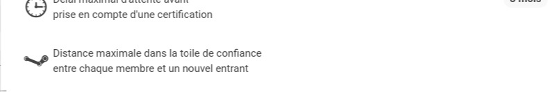
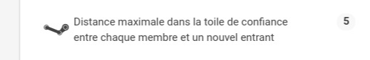

## Présentation

Cet article est le 2ème tutoriel d'initiation au code source du logiciel Cesium.

Vous allez pouvoir comprendre le rôle des différentes couches logicielles,
en les modifiant afin d'améliorer un écran de Cesium.

## Prérequis

Avant de faire ce tutoriel, vous devez :
  
 - Connaitre les fonctionnalités de Cesium. Si ce n'est pas le cas, reportez vous à [la vidéo de présentation générale des fonctionnalités](https://www.youtube.com/watch?v=FQzGIzJf9Nw&list=PLr7acQJbh5rzgkXOrCws2bELR8TNRIuv0&index=6) (RML7) et à celle détaillant les nouveautés (RML8 - lien à venir)
 - Avoir suivi le 1er tutoriel de mise en place de l'environnement [jusqu'au niveau III](https://github.com/duniter/cesium/blob/master/doc/fr/development_tutorial.md)

## Niveau VI : Afficher un paramètre monétaire manquant

__Objectif :__ Dans ce niveau, l'objectif est d'afficher dans la page [`Monnaie`](http://g1.duniter.fr/#/app/currency/view/lg/) le paramètre monétaire `stepMax`.

> Pour rappel, `stepMax` est la distance maximale entre un membre et un postulant, pour que ce dernier puisse rentrer dans la toile de confiance.

### Modifier le template HTML

Ouvrez le fichier de template `/www/templates/currency/items_parameters.html`.

Ajouter un nouvel élément dans la liste des paramètres, c'est à dire un nouveau tag `<ion-item>`, en dessous les autres tag du même nom : 

```html
   (...)

   <ion-item class="item-icon-left">
     <i class="icon ion-steam"></i>
     <span translate>CURRENCY.VIEW.STEP_MAX</span>
     <span class="badge badge-stable">{{stepMax}}</span>
   </ion-item>
```

Si vous rafraichissez la page `Monnaie` de votre navigateur, vous devriez observer la modification :


### Internationliser un libellé

La chaine `CURRENCY.VIEW.STEP_MAX` représente en réalité une **clef de message internationalisé**.
Il nous faut maintenant ajouter la traduction de cette clef.

> L'icone est configurée simplement par la classe CSS `ion-stream`. Pour connaitre les icones disponble, consultez  
le site [ionicons.com](http://ionicons.com/)

Ouvrez le fichier `www/i18n/locale-fr-FR.json` et identifiez l'élément `CURRENCY` puis `VIEW`.
Ajouter la traduction pour notre nouvelle clef :

```json
  "CURRENCY": {
   (...)

  "VIEW": {
    "TITLE": "Monnaie",
    (...)
    "SIG_WINDOW": "Maximum delay a certification can wait<br/>before being expired for non-writing.",
    "STEP_MAX": "Distance maximale dans la toile de confiance<br/>entre chaque membre et un nouvel entrant"
  }
}
```

N'oubliez pas **d'ajouter une virgule** sur la ligne qui précéde...

> Note : l'internationalisation de Cesium utilise le plugin AngularJS [angular-translate](https://github.com/angular-translate/angular-translate).
> Suivant les cas, il est possible d'utiliser des tags HTML, comme ici le tag `<br/>`

Refarichissez la page de votre navigateur : la clef a bien été traduite ! 



Recommencez l'opération dans les **autres fichiers de traduction** présents dans `www/i18n` : 

```
    (...)
    "STEP_MAX": "Maximum distance between<br/>each WoT member and a newcomer"
   }  

```

### Ajouter d'une variable dynamique

Il ne reste plus qu'à afficher dynamiquement la valeur de notre paramètre `stepMax`. Nous utiliserons les fonctions de `data-binding` que permet AngularJS.

> Dans AngularJS, c'est un controlleur qui gère le remplissage des valeurs, typiquement à partir de données obtenues sur le réseau.

Ouvrez le controlleur `CurrencyViewController` présent dans le fichier `www/js/controllers/currency-controllers.js`
Ce controlleur fait déjà un appel à l'API Duniter [`/blockchain/parameters`](http://cgeek.fr:9330/blockchain/parameters).

Identifiez la fonction `load()`.
Modifiez le code de retour de l'appel `/blockchain/parameters`, pour stocker la valeur `stepMax` dans le `$scope` : 

```
function CurrencyViewController($scope, $q, $translate, $timeout, BMA, UIUtils, csSettings, csCurrency, csNetwork) {
  // Ajout d'une propriété qui stockera la valeur de stepMax
  // (On met ici la valeur par défaut)
  $scope.stepMax = 0;
  (...)

  $scope.load = function() {
    (...)
    
    return $q.all([

      // Get the currency parameters
      BMA.node.blockchain.parameters() 
       .then(function(json){
          $scope.currency = json.currency;
          (...)
          // Mise à jour de la valeur, à partir du résultat que renvoi le noeud Duniter
          $scope.stepMax = json.stepMax;
        }),
      (...)
```

> L'objet '$scope' sert à manipuler des valeurs partagées entre le controlleur et le template.
> La valeur que nous avons mise dans `$scope.stepMax` est affichée grâce à l'instruction `{{stepMax}}` que vous avez mise dans le template HTML.

Votre navigateur doit maintenant afficher : 



Bravo, vous savez maintenant afficher de nouvelle valeurs dans les écrans de Cesium !

## Niveau VII : Publier vos modifications

__Objectif :__  Devenir contributeur officiel, en publiant votre code !

### Faire un `pull request`

Si vous n'avez jamais utilisé git sur votre machine courante, il va d'abord falloir que vous définissiez

1. votre adresse e-mail : `git config --global user.email "votre@email.xyz"`
2. vos nom et prénom : `git config --global user.name "Prénom NOM"`

La modification que vous venez de faire correspond en réalité au [ticket #209](https://git.duniter.org/clients/cesium-grp/cesium/issues/209).
Pour lui adjoindre votre modification, et ainsi **devenir officiellement contributeur** de Cesium : 

 * Tapez la commande `git add` suivie des noms des fichiers que vous avez modifiés ou, plus simplement `git add *` pour ajouter au commit tous les fichiers modifiés.
 * Puis faites  un `git commit` pour valider votre code;
 * Enfin, faites un `git push` pour envoyer sur votre repo GitHub.
 * Dans GitLab, connectez-vous sur votre compte;
 * Ouvrez votre dépot `Cesium` via le menu "Projets" > "Your projects" que vous trouverez tout en haut à gauche, dans la barre de navigation.
 * Dans le menu de gauche, rendez-vous dans "Merge requests", et cliquez sur le bouton "New merge request"
 * La plupart des champs étant déjà préremplis, il ne vous reste plus qu'à sélectionner la branche source (si vous n'avez pas changé de branche via la ligne de commande git, c'est "master")
 * Cliquez sur `Compare branches and continue`
 * Dans le titre la référence au ticket : `#209`

Votre contribution est maintenant visible par les développeurs de Cesium, qui pourront plus facilement intégrer votre code.

> _Note :_ Depuis les RML7, ce ticket a été fermé. Vous pouvez donc continuer ce niveau, en ajoutant d'autres variables manquantes (cf paragraphe suivant), puis 
> publier vos modifications : la démarche du `pull request` reste la même.

## Niveau VIII : Modification libre

__Objectif :__  A vous maintenant d'ajouter les informations manquantes, et qui semblent intéressantes.

### Ajouter de nouvelles variables

Pour vous faire la main sur les modifications dans Cesium, vous pouvez ajouter d'autres paramètres manquants de la monnaie.
Par exemple, parmi ceux qui concernent la _BlockChain_ : `xpercent`, `percentRot`, `blocksRot`...

Vous trouverez leur définition dans la [documentation du protocole Duniter](https://github.com/duniter/duniter/blob/master/doc/Protocol.md#protocol-parameters).

> _Astuce :_ pour séparer les différentes partie de l'écran, ajoutez un séparateur, c'est à dire un tag `<div>` avec la classe CSS `item item-divider` :

```html
  <div class="item item-divider">
      <span translate>CURRENCY.VIEW.BLOCKCHAIN_DIVIDER</span>
  </div>
  <!-- paramètres relatifs à la blockchain -->
```

## La Suite ?!

Vous pouvez maintenant poursuivre avec les niveaux qui suivent. Nous y verrons comment compiler et déployer Cesium sur Android, puis comment ajouter un plugin, et même ajouter un graphique dynamique !

[Voir la suite ici >>](./development_tutorial-03-android.md)